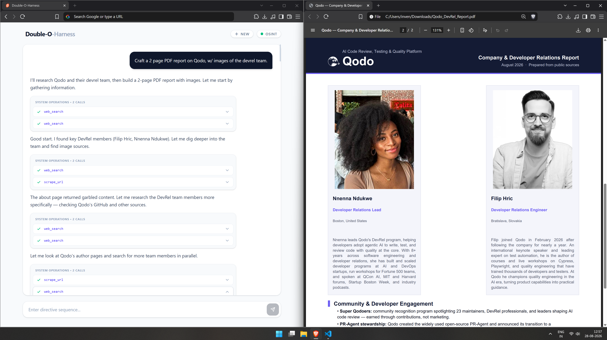
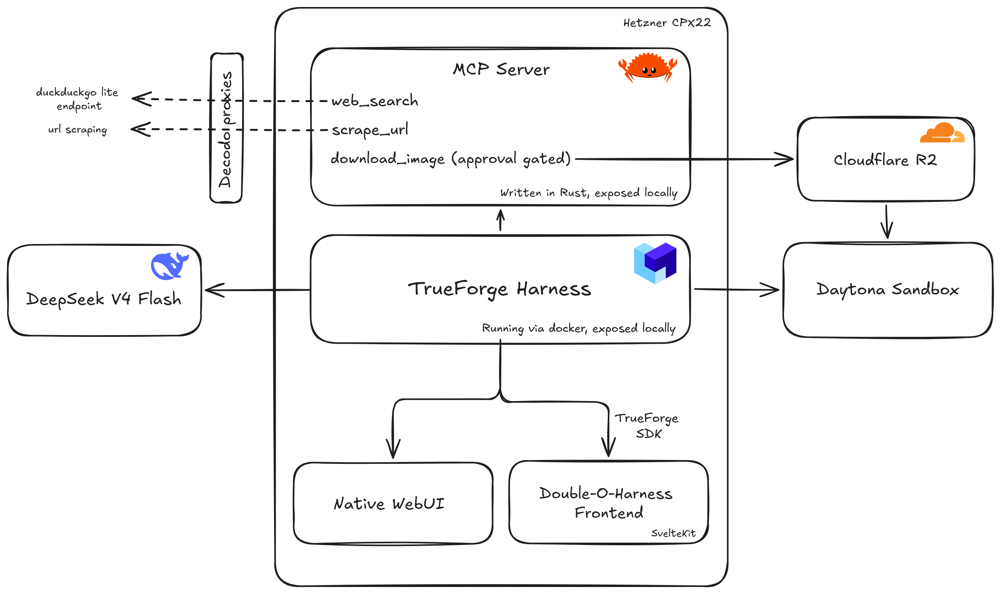
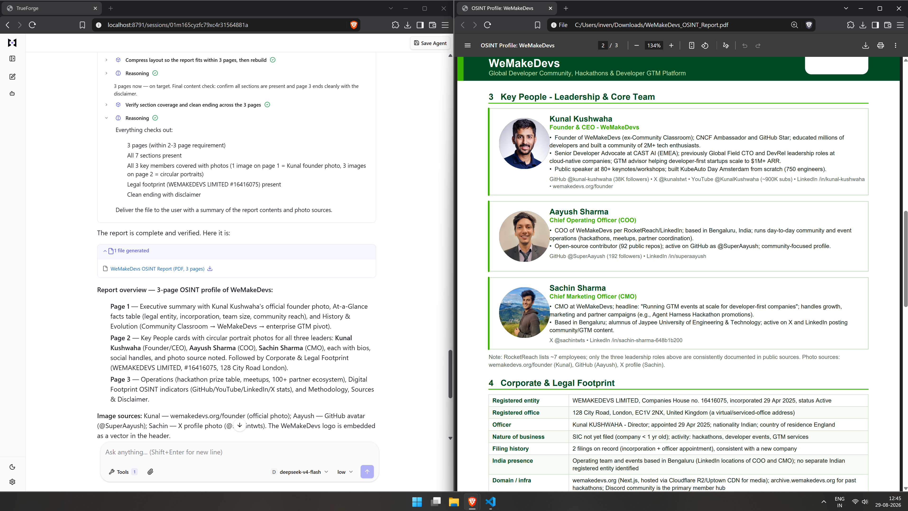

## Double-O-Harness
An ultra-cost efficient, autonomous Open Source Intelligence (OSINT) agent capable of executing hundreds of web searches, subagents for research and multi-page PDF dossier compilation with images.

#### Example OSINT Report on Qodo w/ Custom UI


---

## ⚡ Highlights

* **Extreme Search Economics:** Custom Rust MCP server running [`wreq`](https://github.com/0x676e67/wreq) + DuckDuckGo Lite endpoint + Brotli compression (`~15KB` payload/search) yielding **16,500+ searches per $1** (compared to $1 /1,000 searches with standard SerpAPIs).
* **Daytona Sandbox Egress Bypass:** Solved Daytona's strict outbound network isolation by building an MCP tool that downloads external images into RAM, uploads them to Cloudflare R2 (`r2.cloudflarestorage.com` is on Daytona's essential allowlist), and hands presigned URIs back to the agent.
* **Human-in-the-Loop Gatekeeping:** Built-in TrueForge human approval intercepting unverified image downloads to prevent unwanted image downloads/uploads.
* **Multi-Agent Compilation:** Leverages **DeepSeek V4 Flash** to coordinate parallel sub-agents for research, verification, and rendering formatted multi-page PDF dossiers.
* **Dual UI Support:** Fully compatible with TrueForge’s native WebUI as well as a custom standalone **SvelteKit** dashboard.

---

### 🏗️ Architecture



---

### Core Subsystems

1. **Rust MCP Server (`axum` + `wreq`):**
   * `web_search`: Issues queries to the DuckDuckGo lite endpoint over Decodo proxies with Brotli decompression, stripping overhead before returning structured markdown.
   * `scrape_url`: Fetches target URLs using `wreq` for high-fidelity HTTP fingerprint mimicking, also via proxies.
   * `download_image`: Ingests target images directly into memory and uploads them to Cloudflare R2, generating a presigned URL for sandbox access. This runs without proxies as images are heavy on bandwidth, and are downloaded very sparsely from different domains.
2. **TrueForge Agent Harness:**
   * Coordinates tool calling, manages sub-agent task distribution, and provides human approval.
3. **Daytona Sandboxes:**
   * Isolates arbitrary code execution and PDF generation, preventing secret leakage or host escalation while retaining egress access to Cloudflare R2.

---

## 🚀 Quickstart Guide
### Prerequisites
* [Docker Engine](https://docs.docker.com/engine/install)
* [Rust toolchain](https://rust-lang.org/tools/install/)
* [Node.js](https://nodejs.org/en/download)

### 1. Run TrueForge Harness.

```
git clone https://github.com/truefoundry/trueforge && cd trueforge
cp packages/trueforge/.env.example packages/trueforge/.env
```

Set the HOST to `0.0.0.0` in `packages/trueforge/.env` so that the host machine can access the Docker's harness endpoint.
Just uncomment this line: 
```
# HOST=0.0.0.0
```

Then run
```
docker compose up --build
```

### 2. Run the MCP Server
```
git clone https://github.com/inventwithdean/Double-O-Harness
```

Configure .env file:
```
MI6_PROXY=your_http_proxy_url
R2_ENDPOINT=your_r2_endpoint
R2_BUCKET=your_r2_bucket
AWS_ACCESS_KEY_ID=your_r2_access_key
AWS_SECRET_ACCESS_KEY=your_r2_secret_key
```
Launch the server:
```
cargo run --release
```
Now, configure your LLM, MCP Server and Daytona API inside the TrueForge's Settings at `http://localhost:8791/settings`

* This project uses DeepSeek V4 Flash, configured as `deepseek/deepseek-v4-flash`. If you use something else, then change the
`frontend/src/routes/api/chat/+server.ts` file accordingly.

* Add the custom MCP Server via this URL. This is a private IPv4 address used by Docker as the default gateway to its internal docker0 virtual bridge network. It allows containers to communicate with the host machine and with each other.
So the MCP server binds to this address at PORT `1337`.
   ```
   172.17.0.1:1337
   ```
* Add Daytona API which with full access.

### 3. Run the custom frontend

```
cd frontend
npm run dev
```

Now you can access the custom UI at `http://localhost:5173/`.


TrueForge has its own native UI at `http://localhost:8791/`.
#### Example OSINT Report on WeMakeDevs w/ Native UI


---

## 🤖 Qodo Code Quality & PR Reviews

TODO: Complete this section.

---


